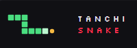

## 🎮 Live Demo

**Play Tanchi Snake:**  
https://tanchi-snake.duckdns.org


# 🐍 Tanchi Snake

<p align="center">
  
</p>

A real-time multiplayer Snake game built with Java, Spring Boot, and WebSockets.

## 🎮 Gameplay

<p align="center">
  
</p>

> The game is deployed on an Oracle Cloud Always Free VM with Caddy handling HTTPS and reverse proxying.

## ✨ Features

- 🎮 Real-time multiplayer gameplay
- 🌐 Browser-based client
- 🔌 WebSocket communication
- 🖥️ Server-authoritative game state
- 💥 Server-side collision detection
- 🐍 Multiple snakes in the same game
- 🎨 Unique player snake colors
- 🆔 Persistent player identities
- 🏠 Game/menu navigation
- ⚡ Low-latency real-time updates

## 🛠️ Tech Stack

### Backend
- **Java 21**
- **Spring Boot**
- **Spring WebSocket**
- **Maven**

### Frontend
- **HTML**
- **CSS**
- **JavaScript**
- **WebSockets**

### Deployment
- **Oracle Cloud Infrastructure**
- **Ubuntu**
- **Caddy**
- **systemd**
- **DuckDNS**

## 🏗️ Architecture

```text
                    ┌──────────────────┐
                    │     Browser      │
                    │   HTML/CSS/JS    │
                    └────────┬─────────┘
                             │
                       HTTPS / WSS
                             │
                             ▼
                    ┌──────────────────┐
                    │      Caddy       │
                    │ Reverse Proxy +  │
                    │      HTTPS       │
                    └────────┬─────────┘
                             │
                         WebSocket
                             │
                             ▼
                    ┌──────────────────┐
                    │   Spring Boot    │
                    │    WebSocket     │
                    │      Server      │
                    └────────┬─────────┘
                             │
                             ▼
                    ┌──────────────────┐
                    │ Authoritative    │
                    │   Game State     │
                    │                  │
                    │ • Movement       │
                    │ • Collision      │
                    │ • Players        │
                    │ • Game Updates   │
                    └──────────────────┘
