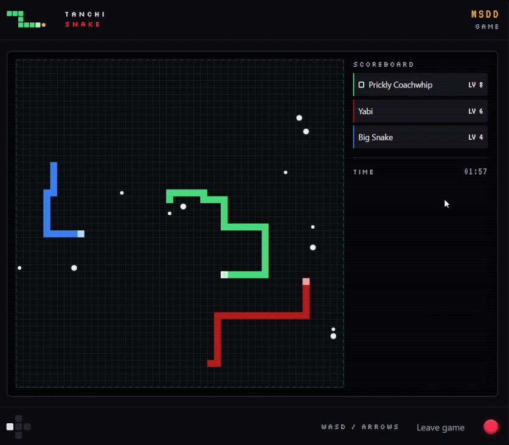

# 🐍 Tanchi Snake

A browser-based multiplayer Snake game with private rooms, real-time play, and an arcade-cabinet interface.



## 🎮 Play online

[Play Tanchi Snake](https://tanchisnake.connorchen.dev)

## 💻 Play locally

Tanchi Snake runs on Java 21. Clone the repository and start the application:

```sh
./mvnw spring-boot:run
```

On Windows:

```powershell
.\mvnw.cmd spring-boot:run
```

Open [http://localhost:8080](http://localhost:8080), create a room, and share its four-character code with up to seven other players.

## ✨ What you can do

- Play a solo round immediately.
- Create or join a private room for up to eight players.
- Start and replay rounds from the lobby.
- Use keyboard arrows or the on-screen controls to steer.
- Reconnect to a dropped game within the room’s grace period.

## 📚 Documentation

- [Installation guide](docs/installation.md) — requirements, running, testing, and common setup problems.
- [Technical guide](docs/technical-guide.md) — project layout, game flow, WebSocket messages, and architecture.

## 🛠️ Built with

Java 21, Spring Boot, WebSockets, and vanilla HTML, CSS, and JavaScript.
